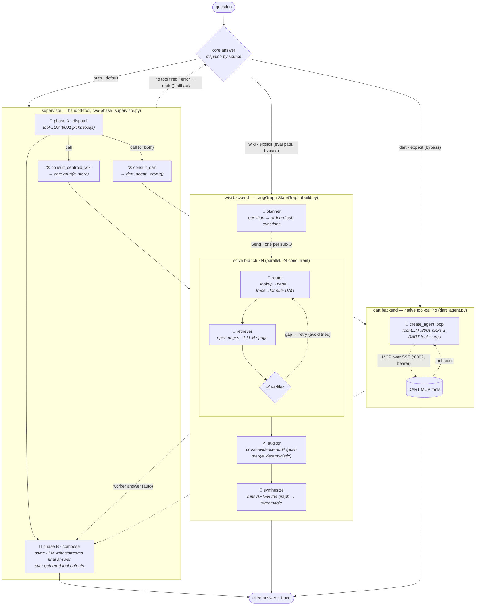

# Agent graph

The query agent (`apps/agent`) is **two backends behind a handoff-tool supervisor**.
`core.answer(source)` dispatches by `source`:

- **`auto`** (default) — the **supervisor** (`apps/agent/supervisor.py`): a tool-calling
  gemma-4 (:8001) with two handoff tools, `consult_centroid_wiki` and `consult_dart`. It
  decides which to call (or **both** for a composite cross-source question), then composes the
  final Korean answer itself.
- **`wiki`** — straight to the Centroid KB LangGraph, **bypassing the supervisor** (the eval
  path is unchanged).
- **`dart`** — straight to the DART tool-calling agent.

`core.route()` (the old LLM wiki-vs-dart classifier) is **kept only as the supervisor's
fallback** — used when the tool-calling round fails or the supervisor calls no tool, so a flaky
round never hard-fails or returns an ungrounded guess.

`get_graph()` only sees the *wiki* `StateGraph` — the supervisor tier and the DART branch live
in `core.py`/`supervisor.py`, outside the compiled graph — so the full architecture is drawn
here, not by LangGraph. Interactive view: open [`agent_graph.html`](agent_graph.html) in a
browser (drag nodes, Cytoscape.js).

## Full architecture

Everything `core.answer()` can do — the supervisor, both backends, and the explicit-source
bypass. This is the diagram the visualizer renders to PNG.

<!-- full-arch:begin -->

<!-- full-arch:end -->

For the **auto** path the worker answers return to the supervisor (dotted → phase B), which
composes the final answer; for an **explicit** `source` the backend answer goes straight to the
output. Deterministic tools (no LLM) on the wiki side: `lookup` (term→page), `open_page`
(page→facts), `trace_links` (BFS over the formula DAG). On the DART side — and in the supervisor
tier — the model itself calls the tools: the gemma-4 container is served *with*
`--tool-call-parser gemma4`, unlike the guest vLLM the wiki retrieval uses.

## Supervisor — two phases

`supervisor.arun_supervised()` / `astream_supervised()`:

- **Phase A — dispatch.** A LangChain `create_agent` tool loop. The two handoff tools are built
  per request as closures over the request's `WikiStore` (`store`) — so the per-request dataset
  threads into the wiki worker, preserving concurrency safety. As each tool runs it appends its
  worker trace (namespaced `wiki:*` / `dart:*`) and answer to shared lists **in execution order**
  (no LangChain message parsing).
- **Phase B — compose.** The same model writes the final Korean answer over the gathered tool
  outputs. The **buffered** path uses the agent's terminal message; the **streaming** path
  re-composes via `ChatOpenAI.astream` so tokens stream (mirrors `graph.nodes.synthesize_stream`).
  Streaming uses `_strip_channel` per delta (channel tokens only, no `.strip()`, or inter-token
  spaces are lost); full `_clean` runs once on the joined answer.
- **Fallback.** Phase-A exception, or no tool fired → `route()` + direct dispatch.
- **Result.** `{source, answer, trace, steps}`; `source` ∈ `wiki | dart | dart+wiki`. The trace
  interleaves `[supervisor] call/result` with the namespaced worker steps, then `[supervisor]
  answer`, renumbered to a single sequential `step`.

## Wiki backend — compiled topology

What LangGraph actually compiles (`build_app().get_graph()`) — the `solve` step is a single
node that fans out via the `Send` API (dotted edge) and runs the router→retriever→verifier loop
internally. The graph **ends at the auditor**; `synthesize()` runs *after* the graph (in `core`)
so the final answer can be streamed token by token.

## Wiki backend — expanded pipeline

What runs at query time. The planner splits the question; each sub-question becomes a
concurrent `solve` branch (≤4 in flight, semaphore-bounded); the auditor runs once all branches
have merged their evidence/paths/trace into the `operator.add` channels; the synthesizer then
runs outside the graph.

```mermaid
flowchart TD;
  START([__start__]) --> P["🧭 planner<br/><i>question → ordered sub-questions<br/>tags each lookup | trace + direction</i>"];

  P -. "Send · sub-Q 0" .-> B0;
  P -. "Send · sub-Q 1" .-> B1;
  P -. "Send · sub-Q N" .-> Bn;

  subgraph FAN["parallel solve branches — ≤4 concurrent (STELLA_FANOUT semaphore)"];
    direction LR;
    subgraph B0["solve · branch 0"];
      direction TB;
      R0["🔀 router<br/><i>lookup → pick page(s)<br/>trace → walk formula DAG</i>"] --> T0["📄 retriever<br/><i>open pages · 1 LLM call / page (fan-out)</i>"];
      T0 --> V0{"✅ verifier"};
      V0 -. "gap → retry (avoid tried)" .-> R0;
    end;
    subgraph B1["solve · branch 1"];
      direction TB;
      R1["🔀 router"] --> T1["📄 retriever"] --> V1{"✅ verifier"};
      V1 -. retry .-> R1;
    end;
    subgraph Bn["solve · branch N"];
      direction TB;
      Rn["🔀 router"] --> Tn["📄 retriever"] --> Vn{"✅ verifier"};
      Vn -. retry .-> Rn;
    end;
  end;

  B0 --> AU["🪶 auditor<br/><i>cross-evidence audit (post-merge, deterministic)<br/>dup-cell · pdf-only · unanswered → caveats</i>"];
  B1 --> AU;
  Bn --> AU;
  AU -. "graph ends (__end__)" .-> SY["📝 synthesize()<br/><i>runs AFTER the graph, streamed token-by-token<br/>join evidence + provenance + caveats → cited Korean answer</i>"];
```

**Merge channels (reducers).** Branches never share working state — picked pages, retries,
and the per-page extraction stay local inside `solve_node`. They return only the
`operator.add` channels, which LangGraph concatenates/sums across the parallel barrier; the
`auditor` reads the *merged* set the per-branch verifier never sees:

| channel | reducer | carries |
|---|---|---|
| `evidence` | `operator.add` | `[{page, cell, term, value, ask}]` from every page read |
| `paths`    | `operator.add` | provenance chains traced over the sheet-level formula DAG |
| `trace`    | `operator.add` | per-turn records (tagged with `sub`; renumbered in `core`) |
| `steps`    | `operator.add` | retriever reads consumed (total work) |

## DART backend — tool-calling loop

`dart_agent._arun()` (sync wrapper `run_dart()`) builds a LangChain `create_agent` over the
DART MCP tools (fetched from the SSE server with a bearer token) and a tools-capable gemma-4
model. The model loops: call a DART tool → read the result → call again or answer. Network/LLM
failures degrade to an error string in the answer rather than raising, so the supervisor/router
can always fall back to wiki. Its message log is rendered into the **same** `{step, agent,
action, arg, thought}` trace shape the wiki agent emits, so the API/UI shows DART tool calls
identically — and the supervisor namespaces them `dart:*` when it invokes this backend as a tool.
