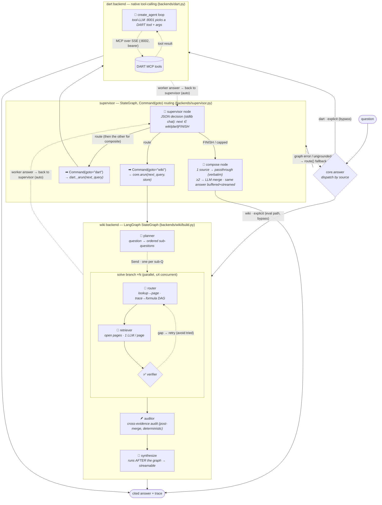
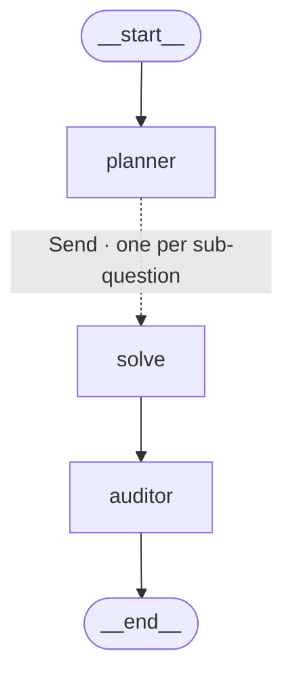
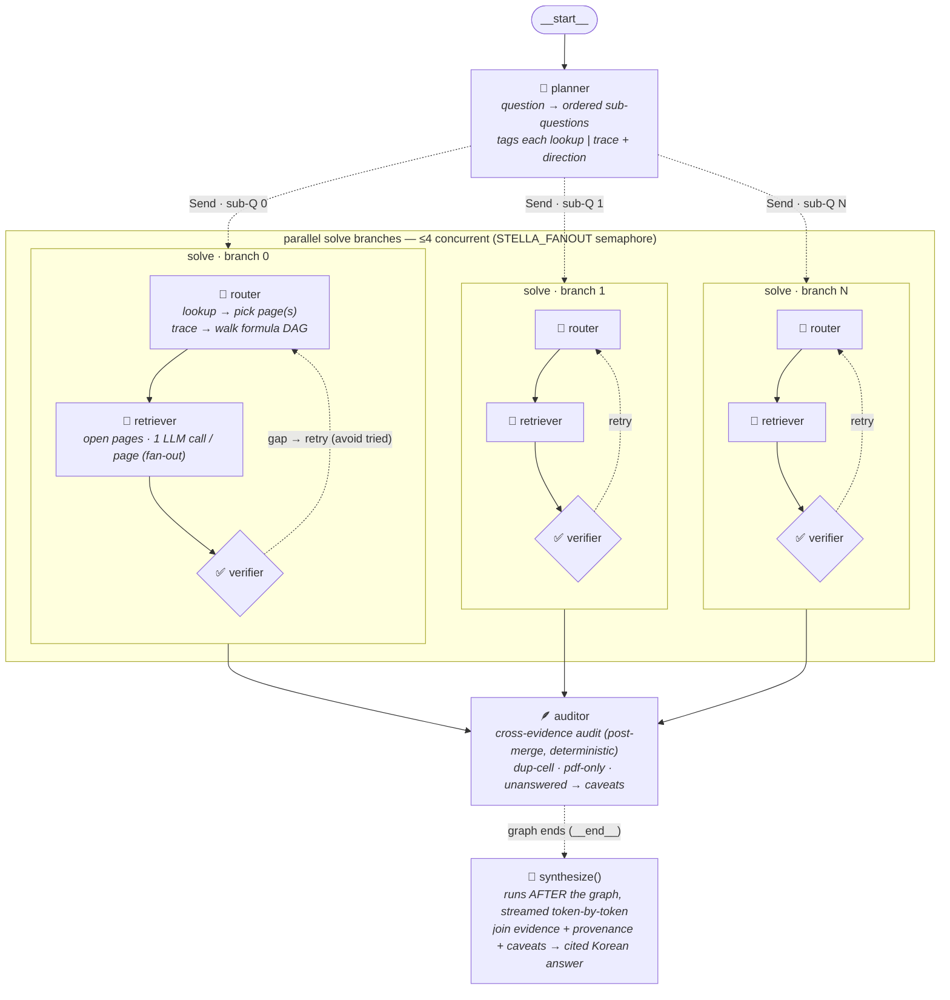

# Agent graph

The query agent (`apps/agent`) is **two backends behind a supervisor `StateGraph`**.
`core.answer(source)` dispatches by `source`:

- **`auto`** (default) — the **supervisor** (`apps/agent/backends/supervisor.py`): a LangGraph
  `StateGraph` whose `supervisor` node routes to `wiki`/`dart` worker nodes via
  `Command(goto=…)`; the workers hand control back, and the supervisor calls the other (or
  **both** for a composite cross-source question) before finishing at a `compose` node. The
  supervisor *decides* with a plain JSON completion (stdlib `chat`, like `route()`), **not**
  tool-calling.
- **`wiki`** — straight to the Centroid KB LangGraph, **bypassing the supervisor** (the eval
  path is unchanged).
- **`dart`** — straight to the DART tool-calling agent.

`core.route()` (the old LLM wiki-vs-dart classifier) is **kept only as the supervisor's
fallback** — used when the graph round fails or returns an ungrounded result, so a flaky
round never hard-fails or returns an ungrounded guess.

**`compose` preserves provenance.** A single-worker answer is returned **verbatim**
(passthrough — its cell citations survive); only a genuine ≥2-source answer gets an LLM merge.
The buffered path (`ainvoke`) and the *composite* streaming path both end at the same `compose`
node, so they return the **same** answer (the composite stream replays it as `token` events).

**Streaming fast-path (single-domain wiki).** `astream_supervised()` first runs the cheap
`route()` classifier: when it returns `wiki` — the overwhelming common case, since `route` flags
`dart` only when a listed-company name is present and a composite question always names one — it
**skips the supervisor graph entirely** and streams the wiki worker's *real* `synthesize_stream`
tokens (true time-to-first-token), saving the supervisor's two serial decision calls
(decide→call, decide→FINISH). Only `dart`/composite questions take the buffered graph + replay
path above.

`get_graph()` only sees the *wiki* `StateGraph` — the supervisor tier and the DART branch live
in `core.py`/`backends/supervisor.py`, outside the compiled graph — so the full architecture is drawn
here, not by LangGraph. Interactive view: open [`agent_graph.html`](agent_graph.html) in a
browser (drag nodes, Cytoscape.js).

## Full architecture

Everything `core.answer()` can do — the supervisor, both backends, and the explicit-source
bypass. This is the diagram the visualizer renders to PNG.

<!-- full-arch:begin -->

<!-- full-arch:end -->

For the **auto** path the worker answers return to the supervisor node (dotted → `SA`), which
routes again — to the other worker for a composite question, or to `compose` to finish; for an
**explicit** `source` the backend answer goes straight to the output. Deterministic tools (no
LLM) on the wiki side: `lookup` (term→page), `open_page` (page→facts), `trace_links` (BFS over
the formula DAG). On the DART side the model itself calls the tools (the gemma-4 container is
served *with* `--tool-call-parser gemma4`); the **supervisor** itself needs no tool-calling — it
routes via a plain JSON decision on the same stdlib `chat` the wiki retrieval uses.

## Supervisor — the StateGraph

`supervisor._build_supervisor(store)` compiles `START → supervisor → {wiki|dart} → … → compose
→ END`. `arun_supervised()` drives it with `ainvoke`; `astream_supervised()` with
`astream(stream_mode="values")`.

- **`supervisor` node.** Decides the next hop with a JSON completion (`_decide` → stdlib `chat`
  + `parse_action`): `next ∈ {wiki, dart, FINISH}` plus a tailored `query` for the chosen
  worker. Returns `Command(goto=…)`. Guards: never re-calls a worker already in `called`, caps
  at `_MAX_TURNS` visits, and **never finishes empty-handed** — a FINISH before any worker ran
  is overridden to ground via the wiki.
- **`wiki` / `dart` worker nodes.** Run the existing backend (`core.arun` / `dart._arun`)
  on the supervisor's `next_query`, then `Command(goto="supervisor")`. The wiki node is a
  closure over the per-request `WikiStore` (`store`), so the dataset threads in concurrency-safely.
  Each appends its worker trace (namespaced `wiki:*` / `dart:*`) + a `[supervisor] result` record
  via the `operator.add` `trace` channel.
- **`compose` node (terminal).** **1 source → passthrough** the worker's answer verbatim (keeps
  its cell citations — no re-prose). **≥2 → LLM merge** over the gathered outputs. No worker ran
  → `source="none"` (the caller grounds via the wiki). Buffered reads this node's `answer`;
  streaming replays it as `token` events — so both paths return the **same** text.
- **Fallback.** Graph exception, or an empty/ungrounded result → `route()` + direct dispatch.
- **Result.** `{source, answer, trace, steps}`; `source` ∈ `wiki | dart | dart+wiki`. The trace
  interleaves `[supervisor] call/result` with the namespaced worker steps, then `[supervisor]
  passthrough` / `answer`, renumbered to a single sequential `step`; `steps` counts worker
  dispatches.

## Wiki backend — compiled topology

What LangGraph actually compiles (`build_app().get_graph()`) — the `solve` step is a single
node that fans out via the `Send` API (dotted edge) and runs the router→retriever→verifier loop
internally. The graph **ends at the auditor**; `synthesize()` runs *after* the graph (in `core`)
so the final answer can be streamed token by token.

## Wiki backend — expanded pipeline

What runs at query time. The planner splits the question; each sub-question becomes a
concurrent `solve` branch (≤4 in flight, semaphore-bounded); the auditor runs once all branches
have merged their evidence/paths/trace into the `operator.add` channels; the synthesizer then
runs outside the graph.

**Merge channels (reducers).** Branches never share working state — picked pages, retries,
and the per-page extraction stay local inside `solve_node`. They return only the
`operator.add` channels, which LangGraph concatenates/sums across the parallel barrier; the
`auditor` reads the *merged* set the per-branch verifier never sees:

| channel | reducer | carries |
|---|---|---|
| `evidence` | `operator.add` | `[{page, cell, term, value, ask}]` from every page read |
| `paths`    | `operator.add` | provenance chains traced over the sheet-level formula DAG |
| `trace`    | `operator.add` | per-turn records (tagged with `sub`; renumbered in `core`) |
| `steps`    | `operator.add` | retriever reads consumed (total work) |

## DART backend — tool-calling loop

`dart._arun()` (sync wrapper `run_dart()`) builds a LangChain `create_agent` over the
DART MCP tools (fetched from the SSE server with a bearer token) and a tools-capable gemma-4
model. The model loops: call a DART tool → read the result → call again or answer. Network/LLM
failures degrade to an error string in the answer rather than raising, so the supervisor/router
can always fall back to wiki. Its message log is rendered into the **same** `{step, agent,
action, arg, thought}` trace shape the wiki agent emits, so the API/UI shows DART tool calls
identically — and the supervisor namespaces them `dart:*` when it invokes this backend as a tool.
